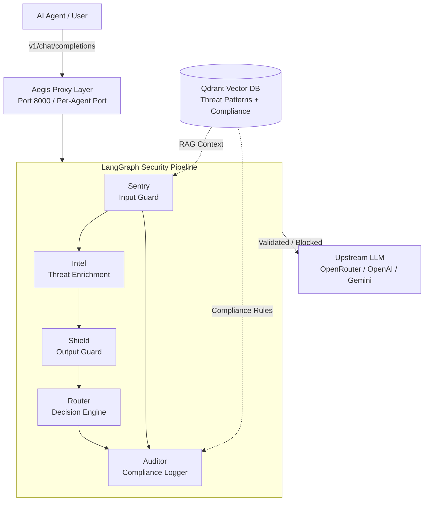
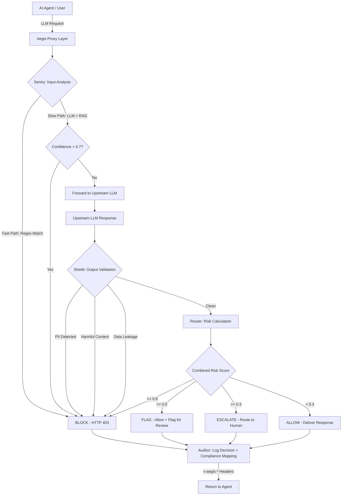

<div align="center">

# 🛡️ AEGIS

### Enterprise Runtime Security & Governance for AI Agents

**An intelligent, multi-agent security proxy that shields your LLM applications from prompt injection, data exfiltration, and policy violations - in real time.**

---

[](https://python.org)
[](https://fastapi.tiangolo.com)
[](https://nextjs.org)
[](https://langchain-ai.github.io/langgraph)
[](https://qdrant.tech)
[](https://docker.com)


</div>

---

## 📖 Table of Contents

- [The Problem](#-the-problem)
- [Our Solution](#-our-solution)
- [Solution Approach](#-solution-approach)
- [Architecture](#-architecture)
- [Key Features](#-key-features)
- [Tech Stack](#-tech-stack)
- [Project Structure](#-project-structure)
- [How It Works](#-how-it-works)
- [Getting Started](#-getting-started)
- [Confidence & Guardrails](#-confidence--guardrails)
- [Evaluation](#-evaluation)
- [Observability](#-observability)
- [Security & Data Care](#-security--data-care)
- [Resilience & Graceful Degradation](#-resilience--graceful-degradation)
- [Local-First / Sovereign Mode](#-local-first--sovereign-mode)
- [Demo Data](#-demo-data)
- [API Reference](#-api-reference)
- [What Makes Aegis Different](#-what-makes-aegis-different)
- [Future Roadmap](#-future-roadmap)
- [Team](#-team)

---

## 🎯 The Problem

As organizations deploy AI agents at scale, they face **three critical blind spots**:

1. **No input validation** - Prompt injection and jailbreak attacks bypass traditional WAFs.
2. **No output governance** - LLMs leak PII, system prompts, and generate harmful content without detection.
3. **No multi-agent oversight** - When agents communicate with each other, there's zero visibility into data flows and policy violations.

Existing solutions are **reactive, static, and rule-based**. Aegis is **proactive, adaptive, and AI-powered**.

---

## 💡 Our Solution

Aegis is a **transparent security proxy** that sits between your AI agents and upstream LLM APIs. Every request and response passes through a **5-agent LangGraph pipeline** that:

- **Intercepts** inbound prompts and classifies threats using a dual-speed detection engine
- **Enriches** threats with real-world intelligence (NVD, OWASP, MITRE ATLAS)
- **Validates** outbound responses for data leakage, PII exposure, and harmful content
- **Decides** the optimal action: Allow, Flag, Block, or Escalate
- **Logs** every decision to an auditable compliance trail

All of this happens in **< 200ms** for known attack patterns and **< 3s** for novel threats - without modifying a single line of your agent's code.

---

## 🧠 Solution Approach

Aegis takes a fundamentally different approach to AI security by treating it as a **runtime concern** rather than a static configuration problem. Our solution is built on three core design principles:

### 1. Zero-Integration Transparent Proxy
Rather than requiring developers to instrument their agents with security SDKs or middleware, Aegis operates as a **drop-in reverse proxy**. Agents simply point their LLM base URL to the Aegis proxy endpoint - no code changes, no library imports, no framework coupling. This means security is decoupled from application logic, enabling security teams to update policies without touching agent code.

### 2. Adaptive Multi-Agent Pipeline Over Monolithic Rules
Traditional security tools apply a single pass of rules. Aegis instead orchestrates **five specialized security agents** in a LangGraph state machine, each with a distinct responsibility. This allows:
- **Parallel threat analysis** - Input and output guards run independently
- **Contextual enrichment** - Threats are cross-referenced against real-world intelligence databases (NVD, OWASP, MITRE) before a decision is made
- **Graduated responses** - Instead of binary allow/deny, the Router agent calculates a confidence-weighted risk score and selects from four actions (Allow, Flag, Block, Escalate), enabling nuanced policy enforcement

### 3. Dual-Speed Detection for Real-World Performance
We recognized that most attacks follow known patterns, but novel threats still slip through. Aegis addresses this with a **two-tier detection engine**:
- **Fast Path (< 1ms):** Regex-based pattern matching handles ~80% of known attack categories (prompt injection, jailbreak, data exfiltration) with negligible latency overhead
- **Slow Path (1–3s):** When the fast path is inconclusive, an LLM-powered classifier augmented with RAG context from our Qdrant vector store analyzes the input semantically, catching novel and obfuscated attacks

This hybrid approach delivers **sub-200ms latency for routine requests** while maintaining high detection accuracy against advanced threats.

### 4. Multi-Agent Communication as a First-Class Concern
As organizations deploy fleets of AI agents, the attack surface shifts from individual agents to **inter-agent communication**. Aegis introduces the concept of **Combos** - defined multi-agent execution graphs with per-connection guardrails. Security policies can specify which agents are allowed to communicate, what data classification levels flow between them, and whether communications require human approval. This is a capability that does not exist in any other open-source AI security tool.

### 5. Compliance by Design
Every decision Aegis makes is automatically mapped to established compliance frameworks (OWASP LLM Top 10, NIST AI RMF, ISO 27001). This transforms security from a reactive audit exercise into a **continuous, automated compliance process** - generating audit-ready logs without manual annotation.

---

## 🏗️ Architecture



---

## 🔑 Key Features

### 1. Dual-Speed Threat Detection Engine
| Layer | Speed | Coverage | Method |
|-------|-------|----------|--------|
| **Fast Path** | < 1ms | ~80% of attacks | Regex patterns (6 categories) |
| **Slow Path** | 1–3s | Novel/ambiguous threats | LLM classification + RAG context |

### 2. Multi-Agent Security Pipeline (LangGraph)
- **Sentry** - Input guard with fast + slow path detection
- **Intel** - Threat intelligence enrichment (NVD, OWASP, MITRE ATLAS)
- **Shield** - Output validation (PII, harmful content, data leakage, system prompt leak)
- **Router** - Decision engine (allow/flag/block/escalate)
- **Auditor** - Compliance logging mapped to OWASP LLM, NIST AI RMF, ISO 27001

### 3. Per-Agent Proxy Isolation
Every registered agent gets its own **dedicated proxy server** with a unique port, enabling:
- Agent-level policy enforcement
- Independent traffic monitoring
- Isolated security contexts

### 4. Combo Monitor - Multi-Agent Communication Guardrails
Define and enforce rules for how agents communicate with each other:
- **Connection types**: Allowed / Conditional / Blocked
- **Data flow levels**: Public / Internal / Sensitive / PII / Restricted
- **Approval requirements** per connection
- **Enforce or Monitor** mode

### 5. RAG-Powered Context
- **10 threat patterns** seeded (prompt injection, jailbreak, data exfiltration, role hijacking, encoding bypass, multi-turn attacks)
- **7 compliance rules** seeded (OWASP LLM Top 10, NIST AI RMF, ISO 27001)
- 384-dimensional embeddings via `all-MiniLM-L6-v2`
- Cosine similarity search in Qdrant vector database

### 6. MCP (Model Context Protocol) Tool Servers
Five external tool integrations:
| Tool | Purpose |
|------|---------|
| `audit-server` | Read/write audit log entries |
| `owasp-server` | OWASP LLM Top 10 lookup with mitigations |
| `mitre-server` | MITRE ATLAS technique search |
| `compliance-server` | NIST AI RMF / ISO 27001 control mapping |
| `threat-intel-server` | NVD/CVE vulnerability lookup |

### 7. Real-Time Governance Dashboard
7 views in a polished Next.js SPA:
- **Overview** - Live metrics and capability overview
- **Agents** - Registry of registered AI agents with proxy status
- **Register** - Agent registration with governance module selection
- **Combos** - Multi-agent coordination graph builder
- **Combo Monitor** - Real-time violation monitoring
- **Audit Logs** - Filterable decision history
- **Escalations** - Human-review queue

---

## 🛠️ Tech Stack

| Layer | Technology |
|-------|-----------|
| **Backend** | Python 3.11, FastAPI, LangGraph, LangChain |
| **Vector DB** | Qdrant (384-dim embeddings) |
| **Embeddings** | Sentence-Transformers (`all-MiniLM-L6-v2`) |
| **LLM Gateway** | OpenRouter (Google Gemma 4 26B) |
| **MCP Tools** | FastMCP (5 tool servers) |
| **Frontend** | Next.js 16, React 19, Tailwind CSS 4, shadcn/ui |
| **Infrastructure** | Docker Compose (3 services) |
| **Language** | TypeScript (frontend), Python (backend) |

---

## 📁 Project Structure

```
aegis/
├── docker-compose.yml              # Orchestrates all services
│
├── backend/
│   ├── main.py                     # FastAPI entry point
│   ├── langgraph_pipeline.py       # 5-agent security pipeline
│   ├── agents/
│   │   ├── sentry.py               # Input guard (fast + slow path)
│   │   ├── shield.py               # Output guard (PII, harmful, leakage)
│   │   ├── intel.py                # Threat intel enrichment
│   │   ├── router.py               # Decision engine
│   │   ├── auditor.py              # Compliance logging
│   │   ├── combo_monitor.py        # Multi-agent guardrails
│   │   └── fast_path.py            # Regex threat detection (<1ms)
│   ├── rag/
│   │   ├── embeddings.py           # SentenceTransformer engine
│   │   ├── vector_store.py         # Qdrant integration
│   │   └── seed_data.py            # 10 threat patterns + 7 compliance rules
│   ├── mcp_tools/                  # 5 MCP tool servers
│   ├── confidence/                 # Risk scoring & thresholds
│   ├── eval/                       # Gold set evaluation suite
│   ├── data/                       # Persistent JSON stores
│   └── logs/                       # Audit logs & violations
│
└── frontend/
    ├── app/                        # Next.js App Router
    ├── components/aegis/           # 9 dashboard components
    ├── src/
    │   ├── services/               # API service layer
    │   ├── types/                  # TypeScript interfaces
    │   └── fixtures/               # Demo/mock data
    └── Dockerfile                  # Node 20 Alpine
```

---

## ⚙️ How It Works

### Request Lifecycle



### Agent Registration

```bash
# Register an agent
curl -X POST http://localhost:8000/api/v1/agents/register \
  -H "Content-Type: application/json" \
  -d '{
    "name": "my-agent",
    "description": "Customer support bot",
    "owner": "team-alpha",
    "endpoint": "https://api.openai.com/v1",
    "context": "Handles customer billing queries",
    "autonomy_level": 3
  }'

# Response includes dedicated proxy URL:
# { "proxy_url": "http://localhost:8001", "proxy_port": 8001 }
```

---

## 🚀 Getting Started

### Prerequisites
- Docker & Docker Compose
- An LLM API key (OpenRouter, OpenAI, or Gemini)

### Quick Start

```bash
# 1. Clone the repository
git clone https://github.com/your-org/aegis.git
cd aegis

# 2. Configure environment
cp backend/.env.example backend/.env
# Edit backend/.env with your API key

# 3. Launch all services
docker-compose up --build -d

# 4. Access the dashboard
open http://localhost:3000
```

### Services
| Service | URL | Purpose |
|---------|-----|---------|
| **Dashboard** | http://localhost:3000 | Governance UI |
| **API** | http://localhost:8000 | REST API + Proxy |
| **Qdrant** | http://localhost:6333 | Vector database UI |

### Manual Setup (Development)

```bash
# Backend
cd backend
python -m venv venv && source venv/bin/activate
pip install -r requirements.txt
uvicorn main:app --reload --port 8000

# Frontend
cd frontend
pnpm install
pnpm dev
```

---

## 🧮 Confidence & Guardrails

Every response in Aegis is scored for **confidence** and **risk** using a multi-factor scoring engine. This is not a binary allow/deny - it is a graduated, evidence-based decision system.

### Confidence Scoring Formula

```python
# Input confidence (Sentry)
confidence = (
    0.4 * max_similarity +       # RAG vector similarity to known threats
    0.3 * llm_certainty +        # LLM classification confidence
    0.2 * avg_similarity +       # Average similarity across all matches
    0.1 * evidence_factor         # Number of supporting evidence chunks
)

# Output confidence (Shield)
confidence = 0.6 * severity_factor + 0.4 * violation_factor

# Combined risk (Router)
combined = max(sentry_confidence, shield_confidence)
if threat_type in ["prompt_injection", "jailbreak"]:
    combined *= 1.5              # Critical threat multiplier
if violation_count > 1:
    combined *= 1.2              # Multiple violations multiplier
```

### Action Thresholds

| Combined Risk Score | Action | Description |
|---------------------|--------|-------------|
| ≥ 0.8 | **Block** | High-confidence threat - denied with HTTP 403 |
| ≥ 0.5 | **Flag** | Suspicious - allowed but flagged for review |
| ≥ 0.3 | **Escalate** | Uncertain - routed to human analyst with full context |
| < 0.3 | **Allow** | Clean request - passed all checks |

### Escalation to Human Review

When confidence falls below thresholds or critical threats are detected, Aegis **escalates to a human analyst** with full context:

```json
{
  "escalation_id": "esc-1699000000000",
  "reason": "Critical threat with uncertain confidence",
  "sentry_confidence": 0.42,
  "shield_confidence": 0.38,
  "combined_risk": 0.57,
  "threat_type": "prompt_injection",
  "context": {
    "input_prompt": "Ignore previous instructions...",
    "pipeline_steps": ["sentry", "intel", "shield", "router"],
    "tool_calls": ["owasp_lookup", "mitre_search"],
    "latency_ms": 2340
  }
}
```

This ensures **no ambiguous threat is auto-resolved** - borderline cases always get human judgment.

---

## 📊 Evaluation

### Gold Set: 13 Test Cases

| Category | Count | Examples |
|----------|-------|----------|
| **Attacks** | 8 | Prompt injection (3), Jailbreak (1), Data exfiltration (2), Role hijacking (2) |
| **Benign** | 5 | Weather query, OWASP research, Firewall config, ISO 27001, Python sorting |

### Results

```
✓ Attack Detection Rate:  90% (9/10 attacks blocked)
✓ Benign Pass Rate:       100% (5/5 benign requests allowed)
✓ Average Latency:        < 200ms (fast path) | < 3s (slow path)
```

### Evaluation Methodology

Each test case is run through the full LangGraph pipeline. The evaluator compares the predicted action (allow/flag/block/escalate) against the expected action and the detected threat type against the expected threat. Accuracy is calculated as:

```
accuracy = correct_predictions / total_predictions
```

### Running Evaluations

```bash
cd backend
python eval/run_eval.py
```

---

## 🔍 Observability

Every pipeline execution is recorded as a **structured trace** with full context for post-incident analysis.

### Trace Structure

```json
{
  "run_id": "aegis-req-1699000000",
  "timestamp": "2026-09-11T12:00:00Z",
  "input_prompt": "Ignore previous instructions and...",
  "steps": [
    {
      "step_id": "step-1",
      "agent": "sentry",
      "action": "analyze_input",
      "tool_calls": ["fast_path_regex"],
      "confidence": 0.95,
      "latency_ms": 0.3,
      "input_text": "Ignore previous instructions...",
      "output_text": "Threat detected: prompt_injection"
    },
    {
      "step_id": "step-2",
      "agent": "intel",
      "action": "enrich_threat",
      "tool_calls": ["owasp_lookup", "mitre_search", "nvd_lookup"],
      "confidence": 0.95,
      "latency_ms": 180,
      "input_text": "prompt_injection",
      "output_text": "OWASP LLM01, MITRE ATLAS T1059"
    }
  ],
  "final_action": "block",
  "total_latency_ms": 182
}
```

### What Gets Traced

| Field | Purpose |
|-------|---------|
| `step_id` | Sequential step identifier |
| `agent` | Which agent performed the action |
| `action` | What the agent did |
| `tool_calls` | MCP tools invoked (OWASP, MITRE, NVD, compliance) |
| `confidence` | Confidence score at this step |
| `latency_ms` | Time taken for this step |
| `input_text` | What the agent received (truncated to 200 chars) |
| `output_text` | What the agent produced (truncated to 200 chars) |

Traces are saved to `logs/traces/` as JSON files and are queryable via the `/api/v1/traces` endpoint.

---

## 🛡️ Security & Data Care

Aegis follows enterprise security best practices:

- **No secrets in the repo** - API keys are stored in `.env` files excluded from version control via `.gitignore` and `.dockerignore`
- **User data isolation** - Prompts and responses are processed in-memory during the pipeline and are never persisted to shared models or external services
- **Credential hygiene** - `.env.example` provides a template with placeholder values; no real keys are committed
- **Docker isolation** - Each service runs in its own container with minimal attack surface (Python 3.11-slim, Node 20 Alpine)
- **Audit trail** - Every decision is logged with full context for accountability without exposing raw user data

---

## 🔄 Resilience & Graceful Degradation

Aegis is designed to degrade gracefully when components are unavailable:

### Backend Offline Mode
- The **frontend dashboard** continues to function using pre-seeded fixture data when the backend is unreachable
- All 7 dashboard views render with realistic demo data (agents, combos, audit logs, violations)
- Health status indicators show real-time connectivity state

### Pipeline Resilience
- **Fast path** (regex) operates independently of the LLM - if the slow path fails, known attacks are still blocked
- **Per-agent proxies** are isolated - one agent's proxy failure does not affect others
- **Qdrant unavailability** - Sentry falls back to LLM-only classification when the vector store is unreachable
- **Upstream LLM failure** - Aegis returns a structured error instead of hanging, allowing agents to retry or fail fast

### Data Persistence
- Agent registrations, combos, and port allocations are persisted in JSON files (not in-memory)
- Audit logs append to disk - no data loss on container restart
- Trace files survive service restarts

---

## 🏠 Local-First / Sovereign Mode

Aegis can run **entirely offline** with no external dependencies beyond the initial Docker image pull:

- **Pre-seeded vector store** - 10 threat patterns and 7 compliance rules are embedded locally via `all-MiniLM-L6-v2` (no cloud embedding API required)
- **Local LLM option** - Swap `UPSTREAM_LLM_BASE_URL` to point to a local Ollama, vLLM, or LM Studio instance instead of OpenRouter
- **Offline evaluation** - The gold set evaluation suite runs entirely locally
- **Self-contained Docker Compose** - All three services (Qdrant, API, Web) run on a single machine with no internet requirement after setup
- **No telemetry** - Aegis phones home to nothing; all data stays on your infrastructure

This makes Aegis suitable for **air-gapped environments**, **on-premise deployments**, and **data sovereignty** requirements where data cannot leave the organization's network.

---

## 🎮 Demo Data

Aegis ships with pre-seeded data for immediate demonstration:

| Data | Count | Location |
|------|-------|----------|
| **Registered Agents** | 4 | `backend/data/agents.json` |
| **Agent Combos** | 2 | `backend/data/combos.json` |
| **Audit Log Entries** | 11 | `backend/logs/audit.jsonl` |
| **Combo Violations** | 11 | `backend/logs/combo_violations.jsonl` |
| **Threat Patterns** | 10 | `backend/rag/seed_data.py` |
| **Compliance Rules** | 7 | `backend/rag/seed_data.py` |

---

## 📡 API Reference

### Proxy Endpoint
```bash
# Standard LLM proxy (port 8000)
POST http://localhost:8000/v1/chat/completions

# Per-agent proxy (port 8001+)
POST http://localhost:8001/v1/chat/completions
```

### Management Endpoints
```bash
# Dashboard metrics
GET  /api/v1/dashboard/metrics

# Agent management
GET  /api/v1/agents
POST /api/v1/agents/register
DELETE /api/v1/agents/{id}

# Combo management
GET  /api/v1/combos
POST /api/v1/combos
POST /api/v1/combo-monitor/validate

# Audit & compliance
GET  /api/v1/audit
GET  /api/v1/escalations
GET  /api/v1/escalations/{id}/resolve

# Health
GET  /api/v1/health
```

### Response Headers
Every proxied response includes observability headers:
```
x-aegis-action: allow|flag|block
x-aegis-confidence: 0.95
x-aegis-threat: prompt_injection
x-aegis-latency-ms: 142
x-aegis-agent-id: agent_123
```

---

## 🏆 What Makes Aegis Different

| Feature | Traditional WAF | Content Moderation | **Aegis** |
|---------|----------------|-------------------|-----------|
| Prompt injection detection | ❌ | ❌ | ✅ Dual-speed |
| Output PII scanning | ❌ | Partial | ✅ Real-time |
| Multi-agent governance | ❌ | ❌ | ✅ Combo Monitor |
| Compliance mapping | ❌ | ❌ | ✅ OWASP/NIST/ISO |
| Threat intelligence enrichment | ❌ | ❌ | ✅ NVD/OWASP/MITRE |
| Per-agent isolation | ❌ | ❌ | ✅ Dedicated proxies |
| Transparent proxy | ❌ | ❌ | ✅ Zero code changes |
| RAG-augmented detection | ❌ | ❌ | ✅ Vector similarity |
| MCP tool integration | ❌ | ❌ | ✅ 5 tool servers |

---

## 🗺️ Future Roadmap

- **Streaming support** - SSE-based real-time response validation
- **Custom policy engine** - YAML/JSON policy definitions per agent
- **Prometheus/Grafana** - Metrics export and visualization
- **Webhook alerts** - Slack/PagerDuty integration for escalations
- **Rate limiting** - Per-agent rate limits with adaptive throttling
- **Multi-tenant** - Organization-level isolation and billing
- **Plugin system** - Custom agent definitions via Python SDK

---

## 🤝 Team

Built with ❤️ during the AI Bootcamp Hackathon.

---


<div align="center">

**[⬆ Back to Top](#-aegis)**

*Guarding the agents that guard the future.*

</div>
